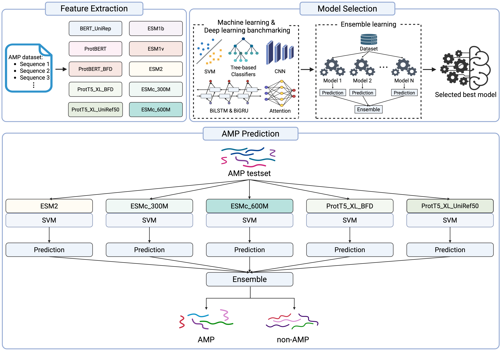

# EnsemPLM-AMP

EnsemPLM-AMP is a predictive model for antimicrobial peptides (AMPs). It leverages embeddings from ten protein language models, including ProtBERT, ProtT5, and the ESM series, to compare and analyze the performance of various machine learning and deep learning approaches. The final model is an SVM-based ensemble that achieves superior performance. On the XU independent dataset, it reaches an ACC of 0.755 and an MCC of 0.546, representing state-of-the-art results.


## Model workflow


## Installation Guide

This code requires Python 3. For simplicity, I recommend using Anaconda. If conda is not installed on your system, you can download it [here](https://docs.anaconda.com/miniconda/).

1. (Optional) Create a conda environment for this workshop and activate it:

```bash
conda create -n EnsemPLM-AMP python=3.10.16
source activate EnsemPLM-AMP
```

2. Install the environment:

```bash
pip install -r requirements.txt
```

## Dataset
All datasets are located in the [data folder](./data).

## Usage

To extract PLM features, please run the Python scripts provided in the `PLM_feature_extraction` directory.  *Note: Downloading the pretrained weights for the PLM may take some time.*

For example:
```bash
python PLM_feature_extraction/esm2.py
```

To train the models, please run the machine learning classifier scripts located in the `./train` directories.

Example:
```bash
python train//SVM_esm2.py
```

How to run the XU independent dataset using the pre-trained weights:

```bash
python test.py
```


Inference time:
The model performs predictions efficiently, with inference time varying depending on the dataset size and system specifications. The measured inference times are as follows:

    XU_independent dataset: 299.90 ± 4.89 seconds

    Per Sample: 0.0976 ± 0.0016 seconds

## Author

Yong Eun Jang, Minjun Kwon, Nimisha Pradeep George, Ji Su Hwang, Seok Gi Kim, Shaherin Basith, Sampa Misra, Chan Woo Kwon, Gwang Lee

## Reference

To be added once the paper is published.